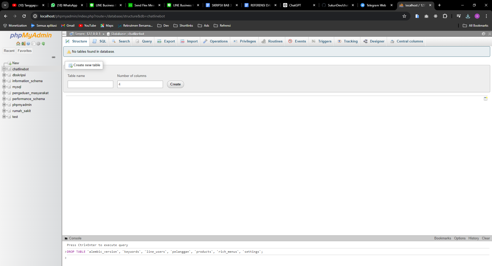

# Chat Bot Line Luxas Autodetailing

## Cara Installasi

```bash
git clone https://github.com/SukunDev/chat-bot-line-luxas-autodetailing.git
cd chat-bot-line-luxas-autodetailing
python -m venv .venv
cd .venv/scripts
activate
cd ../..
pip install requirements.txt
flask run
```

<p align="center">

<p>

Setelah itu kamu dapat mengakses `http://localhost:5000`

## Inisiasi Database

Buat database mysql bernama chatbotline (bisa di custom)

<p align="center">

<p>

kita edit dulu .flaskenv

<p align="center">

<p>
dan mari kita jalankan perintah untuk inisialisasi database

```bash
flask db init
flask db migrate
flask db upgrade
```

<p align="center">


<p>

baru anda dapat melakukan input keyword secara manual atau menggunakan api yang sudah saya siapkan

```
POST /api/keywords/create HTTP/1.1
Host: localhost:5000
Content-Type: multipart/form-data; boundary=----WebKitFormBoundary7MA4YWxkTrZu0gW
Content-Length: 262

------WebKitFormBoundary7MA4YWxkTrZu0gW
Content-Disposition: form-data; name="keywords"

apakabar
------WebKitFormBoundary7MA4YWxkTrZu0gW
Content-Disposition: form-data; name="answer"

Baik, ada hal yang bisa saya bantu
------WebKitFormBoundary7MA4YWxkTrZu0gW--

```

<p align="center">

<p>

## Setup Port Fowarding

anda bisa masuk ke VS Code lalu pilih PORT

<p align="center">

<p>

lalu pilih **Foward a Port** dan masukkan port flask yang sudah di jalankan tadi. biasanya port berada di `5000`

<p align="center">

<p>

baru kita bisa ganti visibility nya dari **private** ke **public**

## Setup Bot Line

<p align="center">

<p>

anda dapat login ke line bisnis dan ambil **secret** dan **access_token** anda. dan anda bisa masukkan ke .flaskenv anda

```
FLASK_APP=app
FLASK_DEBUG=1


FLASK_DATABASE_NAME=chatlinebot
FLASK_DATABASE_USERNAME=root
FLASK_DATABASE_PASSWORD=
FLASK_DATABASE_HOST=127.0.0.1
FLASK_DATABASE_PORT=3306

FLASK_LINE_SECRET=
FLASK_LINE_ACCESS_TOKEN=

FLASK_URL=
```

dan setup webhook dengan fowarding address anda dengan endpoints /webhook
contoh: https://xk81kk07-5000.asse.devtunnels.ms/webhook

<p align="center">

<p>

## Mencoba bot

anda bisa menambahkan id bot line anda dan mencoba mengirim pesan ke bot anda

<p align="center">

<p>
